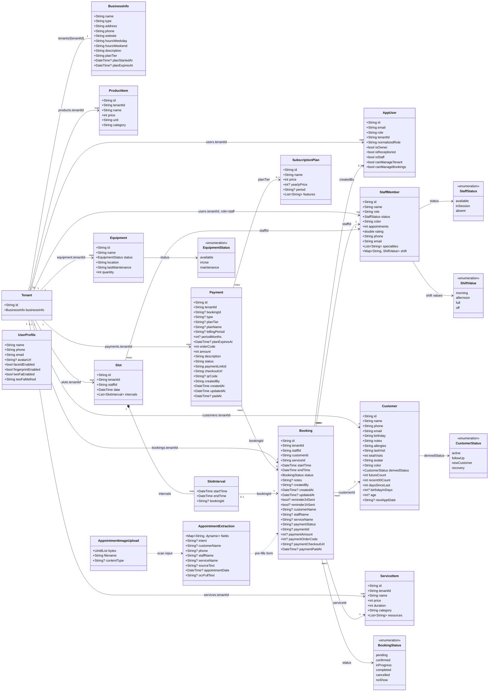
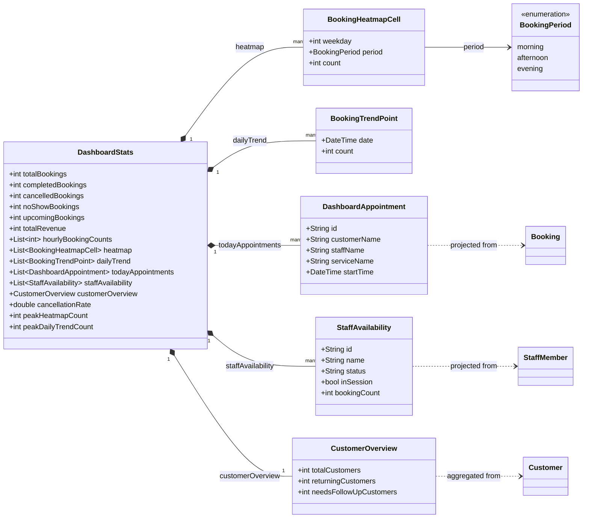
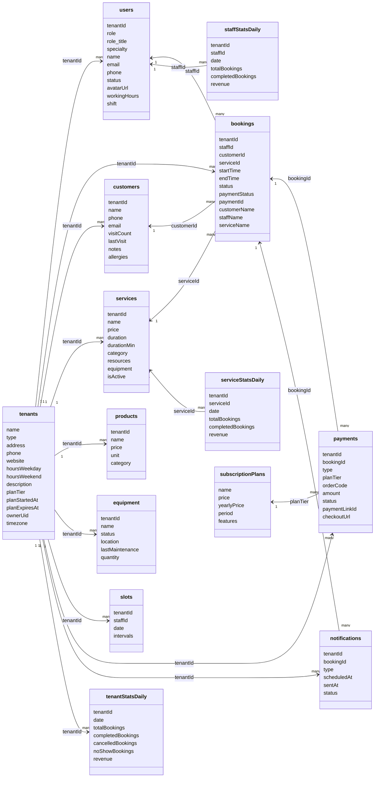
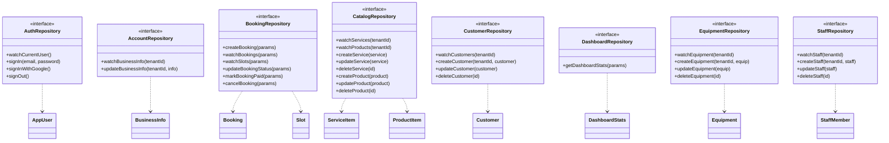

# Project Model UML

This document describes the current Dart domain entities, Firestore data models,
and the main relationships between them. The diagrams use Mermaid and render in
GitHub-flavored Markdown.

## Verification Scope

This UML is synced with the current repository code: Dart entities, data models,
Firestore datasources, Cloud Functions, seed/sync scripts, and local
`firestore.rules`.

Live Firestore data still needs a read-only audit with Firebase credentials:

```bash
cd functions
npm run data:audit
```

The local code audit found one important rules mismatch: the app has a
`products` collection in `CatalogDataSource`, but local `firestore.rules` does
not currently define `match /products/{id}`.

## Domain Model



## Firestore DTO Inheritance

The data layer models subclass domain entities and add mapping logic such as
`fromFirestore`, `toFirestore`, or `toJson`.

```mermaid
classDiagram
direction TB

class AppUser
class UserModel {
  +fromAppUser(AppUser user)
  +fromJson(Map json)
  +toJson()
}

class BusinessInfo
class BusinessInfoModel {
  +fromFirestore(DocumentSnapshot doc)
  +toFirestore()
}

class Booking
class BookingModel {
  +fromFirestore(DocumentSnapshot doc)
  +toFirestore()
}

class Slot
class SlotModel {
  +fromFirestore(DocumentSnapshot doc)
  +toFirestore()
}

class SlotInterval
class SlotIntervalModel {
  +fromJson(Map json)
  +toJson()
}

class ServiceItem
class ServiceModel {
  +fromFirestore(DocumentSnapshot doc)
  +toFirestore()
}

class ProductItem
class ProductModel {
  +fromFirestore(DocumentSnapshot doc)
  +toFirestore()
}

class Customer
class CustomerModel {
  +fromFirestore(DocumentSnapshot doc)
  +toFirestore()
}

class DashboardStats
class DashboardStatsModel {
  +fromAggregates(...)
}

class Equipment
class EquipmentModel {
  +fromFirestore(DocumentSnapshot doc)
  +toFirestore()
}

class StaffMember
class StaffModel {
  +fromFirestore(DocumentSnapshot doc)
  +toFirestore()
}

AppUser <|-- UserModel
BusinessInfo <|-- BusinessInfoModel
Booking <|-- BookingModel
Slot <|-- SlotModel
SlotInterval <|-- SlotIntervalModel
ServiceItem <|-- ServiceModel
ProductItem <|-- ProductModel
Customer <|-- CustomerModel
DashboardStats <|-- DashboardStatsModel
Equipment <|-- EquipmentModel
StaffMember <|-- StaffModel
```



## Dashboard Aggregate Model

Dashboard statistics are not a single Firestore document in the domain layer.
`DashboardStatsModel.fromAggregates` builds them from bookings, staff, customers,
and daily stats queries. The scripts also maintain supporting analytics
collections such as `tenantStatsDaily`, `staffStatsDaily`, `serviceStatsDaily`,
`aiInsights`, `dashboardChartData`, and `weeklyRevenue`.



## Firebase Collections



## Repository Boundaries



## Relationship Notes

- `Tenant` is a conceptual Firestore aggregate root (`tenants/{tenantId}`), not a
  dedicated Dart entity. Most tenant-owned documents carry a `tenantId` field.
- Staff profiles are stored in `users` documents with `role = staff`, while
  authenticated users are represented in Dart by `AppUser`.
- `Booking.staffId`, `Booking.customerId`, and `Booking.serviceId` are the core
  scheduling relationships. `customerName`, `staffName`, and `serviceName` are
  denormalized display fields.
- `Slot` is staff/day availability. Each `SlotInterval.bookingId` optionally
  points back to the booking occupying that interval.
- Catalog `ServiceItem.resources` currently stores resource names or ids as
  strings; seed/sync scripts also support the legacy Firestore field
  `equipment`.
- `ProductItem` and `ProductModel` exist in Dart and use the `products`
  collection, but local `firestore.rules` does not yet expose product read/write
  permissions.
- `Payment` and `SubscriptionPlan` are represented in Cloud Functions and
  Firestore, but not currently as Dart domain entities.
- Dashboard models are read-side projections. They summarize bookings, staff,
  and customers rather than owning those records.
